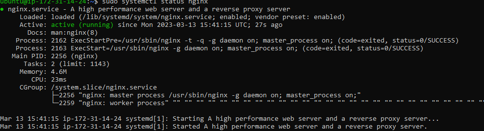
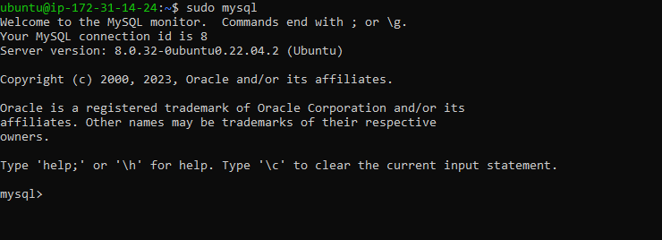
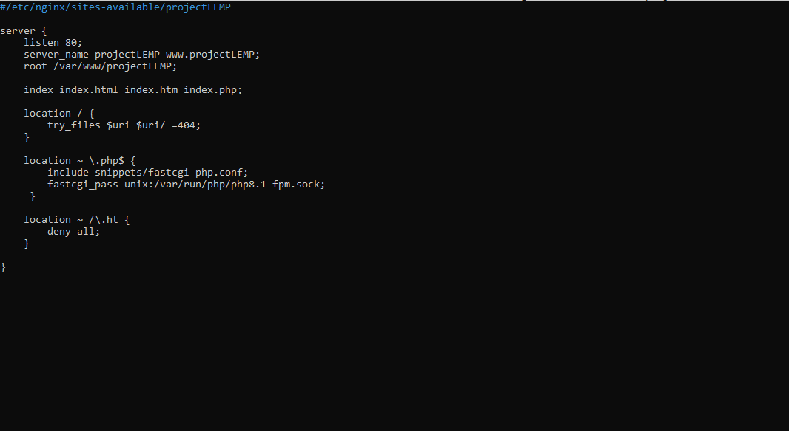
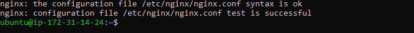
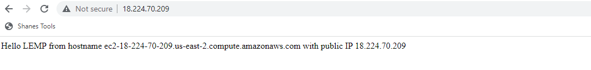
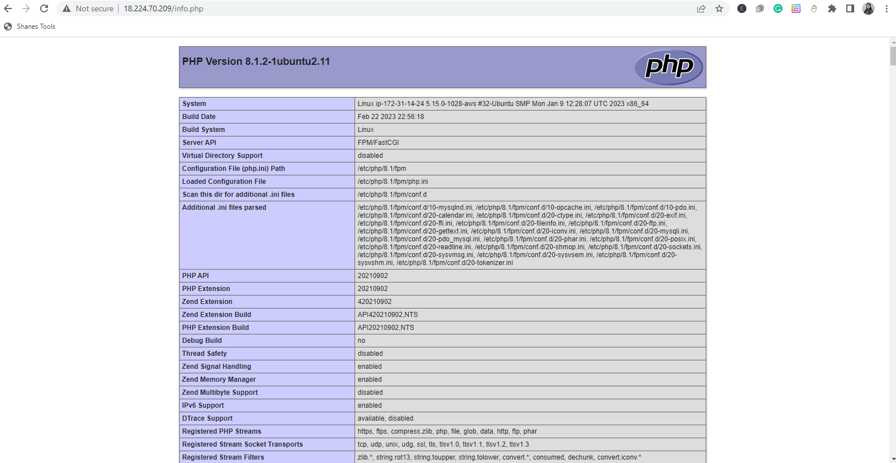
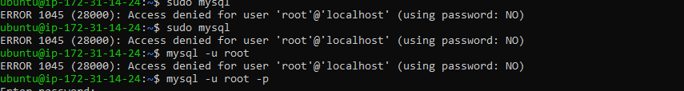
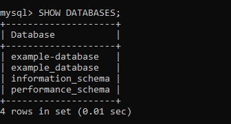
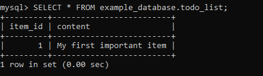
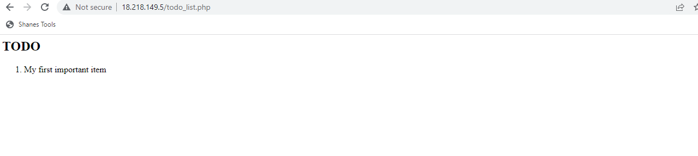

# Documentation of project-2.

Launch an instance

Connect to your server through ssh

## installing Nginx 

`sudo apt update`

`sudo apt install nginx`

To Check the status: `sudo systemctl status nginx`

Open port 80

`http://<Public-IP-Address>:80`

## Installing Mysql

`sudo apt install mysql-server`

`sudo mysql`

## Installing PHP

`sudo apt install php-fpm php-mysql`

## Configure Nginx to use PHP

Create the root web directory for your_domain

`sudo mkdir /var/www/projectLEMP`

Assign ownership of the directory with the $USER environment variable:`sudo chown -R $USER:$USER /var/www/projectLEMP`

Open a configuration file in Nginx: `sudo nano /etc/nginx/sites-available/projectLEMP`

Activate configuration: `sudo ln -s /etc/nginx/sites-available/projectLEMP /etc/nginx/sites-enabled/`

`sudo nginx -t`

Disable default Nginx to listen to port 80: `sudo unlink /etc/nginx/sites-enabled/default`

Reload Nginx: `sudo systemctl reload nginx`

`sudo echo 'Hello LEMP from hostname' $(curl -s http://169.254.169.254/latest/meta-data/public-hostname) 'with public IP' $(curl -s http://169.254.169.254/latest/meta-data/public-ipv4) > /var/www/projectLEMP/index.html`

In your browser: [Browser](http://<Public-IP-Address>:80)

Or [DNS](http://<Public-DNS-Name>:80)

## Testing PHP with NGINX

Create a PHP file: `sudo nano /var/www/projectLEMP/info.php`

Enter `<?php
phpinfo();`

[Browser](http://`server_domain_or_IP`/info.php)

Remove the file you created:`sudo rm /var/www/your_domain/info.php` 

## Retrieving data from Mysql database with PHP
`sudo mysql`

Had an error message and was able to rectify it with: `mysql -u root -p`, then type in your password.

Create a new database, note the part that says example should be replaced with the name of your database of your choice and password should be replaced with a password of your choice.

`mysql> CREATE DATABASE `example_database`;`

Then create a new user :`CREATE USER 'example_user'@'%' IDENTIFIED WITH mysql_native_password BY 'password';`

Grant your database a permission, so as to have full access: `GRANT ALL ON example_database.* TO 'example_user'@'%';`

`exit`

To test your new user: `-u example_user -p`

Confirm you have access to your database with:`SHOW DATABASES;`

Create a to-do list with test table:`CREATE TABLE example_database.todo_list (`

Add the following code to the file one after the other

`item_id INT AUTO_INCREMENT,`

`content VARCHAR(255),`

`PRIMARY KEY(item_id)`

`);`

`INSERT INTO example_database.todo_list (content) VALUES ("My first important item");`

`SELECT * FROM example_database.todo_list;`

Create a PHP script that will connect to MySQL and query for your content. Create a new PHP file in your custom web root directory using your preferred editor: 
`nano /var/www/projectLEMP/todo_list.php`

Add this to the script

<?php
$user = "example_user";
$password = "password";
$database = "example_database";
$table = "todo_list";

try {
  $db = new PDO("mysql:host=localhost;dbname=$database", $user, $password);
  echo "<h2>TODO</h2><ol>";
  foreach($db->query("SELECT content FROM $table") as $row) {
    echo "<li>" . $row['content'] . "</li>";
  }
  echo "</ol>";
} catch (PDOException $e) {
    print "Error!: " . $e->getMessage() . " ";
    die();
}

ctr+x, the y, then enter if you are using nano editor, or :wq, if you are using vim

Access your web browser with: 
[Browser](http://<Public_domain_or_IP>/todo_list.php)

